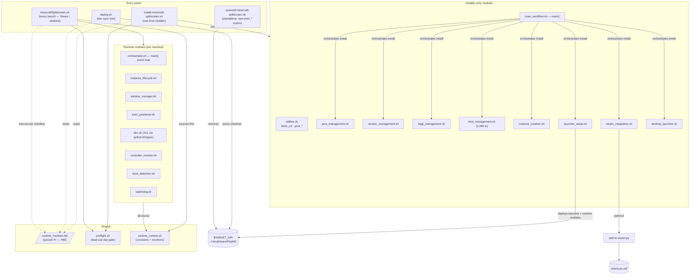
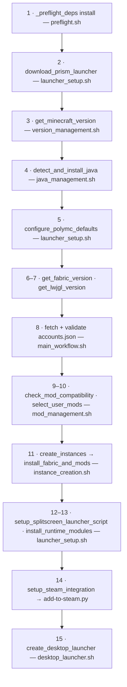
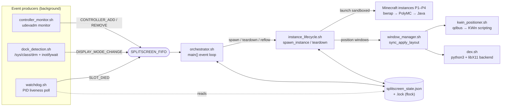

# Architecture Audit — Script Interaction Map & Cleanup Findings

**Date:** 2026-07-17 · **Baseline:** `main` @ 5a51cc2 · **Method:** three parallel
analysis agents (runtime map, installer map, cross-cutting magic-number/duplication
sweep), findings hand-consolidated.

**Issues filed from this audit:** #85 (reflow resolver bypass), #86 (constants
hygiene batch), #87 (JVM mem source-order coupling), #88 (version-match ladder ×4),
#89 (manifest parse ×4 + stamp sed ×2), #90 (legacy prototype path + dex dead API),
#91 (installer module merges). Pre-existing: #47 (token dup, =D2), #27 (low-severity
batch), #52 (style-guide retrofit).

**Placement rules that fall out of this audit live in
[docs/ARCHITECTURE.md](ARCHITECTURE.md)** — this file is the point-in-time findings
record; that one is the living law.

---

## 1. The big picture

The repo is **two products sharing one `modules/` directory**: an *installer* (runs
once) and a *runtime launcher* (runs every session). The boundary is defined by
`modules/runtime_modules.list` — the one shared manifest. `deploy.sh` and the
uninstaller are standalone side tools; `system/deck-display-fixes/` is a fully
independent systemd sub-installer nothing else invokes.

`watchdog.sh` and `dex.sh` are the two runtime modules that do **not** source
`runtime_context.sh` themselves — they rely on the launcher having sourced
everything (documented in ARCHITECTURE.md §sourcing).

## 2. Install flow (main() in main_workflow.sh)

Instance 1 downloads all mod jars; instances 2–4 copy from instance 1. Steps 12–13
are install-fatal (a launcher without runtime modules is a brick).

## 3. Runtime flow

Production path: Steam runs `minecraftSplitscreen.sh launchFromPlasma` → nested
Plasma session (`dbus-run-session startplasma-wayland`) → re-enters itself as
`prodFromPlasma` → orchestrator `main()`. From there it is event-driven around one
FIFO and one JSON state file:

## 4. Magic numbers

The centralization effort (#43/#45/#50/#51) worked: most timing values are named
`readonly` constants and `runtime_context.sh` is the constants root. What remains
falls into three buckets; the first is the valuable one because **the named
constant already exists and specific sites bypass it**.

### 4a. Constant exists, site bypasses it

| Value | Canonical home | Bypassing sites | Issue |
|---|---|---|---|
| `flock -w 5` | `MCSS_STATE_LOCK_TIMEOUT_S` (runtime_context.sh:167) | orchestrator.sh:111, instance_lifecycle.sh:610 | #86 |
| 1280×800 fallback | `MCSS_SCREEN_W/H` (runtime_context.sh:497) | orchestrator.sh:188 (private xdpyinfo probe — worst), window_manager.sh:201, minecraftSplitscreen.sh:1369 | #85 |
| player count 4 | `MCSS_MAX_PLAYERS` (+ documented installer pair) | `WATCHDOG_MAX_SLOT=4` (watchdog.sh:33) | #86 |
| 3072/512 MB heap | `MCSS_MAX/MIN_MEM_MB` (instance_creation.sh:21) | launcher_setup.sh:76 consumes with **no fallback** (source-order coupling) | #87 |
| `timeout 3` probes | — (none) | runtime_context.sh:339/356/373/487 (×4) | #86 |

### 4b. Unnamed literals in logic (lower priority)

- steam_integration.sh:97–142 — `sleep 3/2/1`, `max_attempts=10` (#86 item 5)
- version_management.sh:39/352/405 — top-20 slice, show-10 menu, Fabric `0.16.9`
  fallback pin
- instance_creation.sh:498–579 — the pinned options.txt wall (renderDistance:12,
  maxFps:120, music 0.3, …) — note #70 wants these *varied per slot count*, which
  will force extracting them anyway
- instance_lifecycle.sh:545/736/231 — warm-up threshold `_i > 10`, `sleep 86400`
  stub lifetime, `RADV_SYS_MEM_LIMIT=50`
- minecraftSplitscreen.sh:779/792/923/1078 — boot budget 90s, wait budget 30s,
  reap retries 8, test cap 7200s
- add-to-steam.py:82/114/127 — VDF binary tags + `0x80000000` appid flag
  (external Steam format contract; acceptable as locals)

### 4c. Dead constants

`INSTANCE_LIFECYCLE_WINDOW_WAIT_TIMEOUT_S` and `WINDOW_MANAGER_WINDOW_WAIT_TIMEOUT_S`
are defined and never referenced (#86 item 3).

## 5. Duplicate functions & logic

| # | Cluster | Copies | Tracking |
|---|---|---|---|
| 1 | CurseForge token fetch + decrypt (incl. hardcoded passphrase) | 7 | **#47** (pre-existing, =D2) |
| 2 | Modrinth/CF version-match fallback ladder | 4 | #88 |
| 3 | runtime_modules.list parsing | 4 | #89 |
| 4 | Version-stamp `sed` (launcher_setup vs deploy.sh) | 2 | #89 |
| 5 | Quad-geometry math (`compute_geometry` / `compute_slot_geometry` / sweep table) | 3 | #90 |
| 6 | Legacy prototype path vs modules (launchSlot↔spawn_instance, …) | 2 | #90 |
| 7 | Raw curl/wget bypassing `fetch_url` (AppImage, JDK tarball, mod_management ×2) | 5+ | #88 (API sites) / #47 |
| 8 | `print_*` in uninstaller (standalone by design; ℹ️-vs-💡 drift) | 2 | #86-adjacent, cosmetic |
| 9 | AppImage-detection cascade (utilities.sh vs runtime_context.sh) | 2 | boundary-justified; documented in ARCHITECTURE.md |
| 10 | Process-tree walkers (`_kill_tree` vs `_emit_pid_tree`) | 2 | fold when #90 touches the launcher |
| 11 | `main()`/`cleanup()` name collisions (installer vs orchestrator scopes) | 2 | naming trap only; ARCHITECTURE.md rule |
| 12 | SteamGridDB icon URL (desktop_launcher.sh + add-to-steam.py) | 2 | #91 |

Already consolidated (don't re-litigate): `mcss_query_displays`,
`parse_input_device_blocks`, `_detect_xauthority`, `_launcher_env_core`,
`_ensure_state_file`, `_start_nested_plasma`, `write_mmc_pack_json`, `fetch_url`.

## 6. Streamlining

**Merge candidates (#91):** lwjgl_management → version_management (with the Java
table, one version-resolution module) · desktop_launcher + steam_integration →
one system-integration module · launcher_setup split by responsibility.

**Dead code (#90):** the Phase-A prototype path in minecraftSplitscreen.sh
(`runStaticTest`, `launchSlot`, `waitForAllReady`, `quitSlot(s)`,
`find_controller_pairs`, `compute_geometry`, `logMsg`, `launchWindowTest`,
`nestedPlasma`); `setSplitscreenModeForPlayer` + splitscreen.properties (mod is
gone); 11 unused dex functions + backend actions; shims
`download_and_run_jdk_installer`, `ensure_bwrap_installed`.

## 7. Suggested order

1. #86 (mechanical constants batch) — trivial, safe.
2. #85 + #87 — correctness-adjacent (wrong-screen reflow risk; silent empty
   polymc.cfg values).
3. #47 + #88 together — the mod-pipeline dedup (call sites overlap).
4. #90 — the big deletion (own PR, deletions-only, stage1 smoke + one prod
   launch to validate).
5. #89, #91 — structural; align with the #52 retrofit ordering (merge before
   retrofitting to avoid retrofitting files that are about to disappear).
